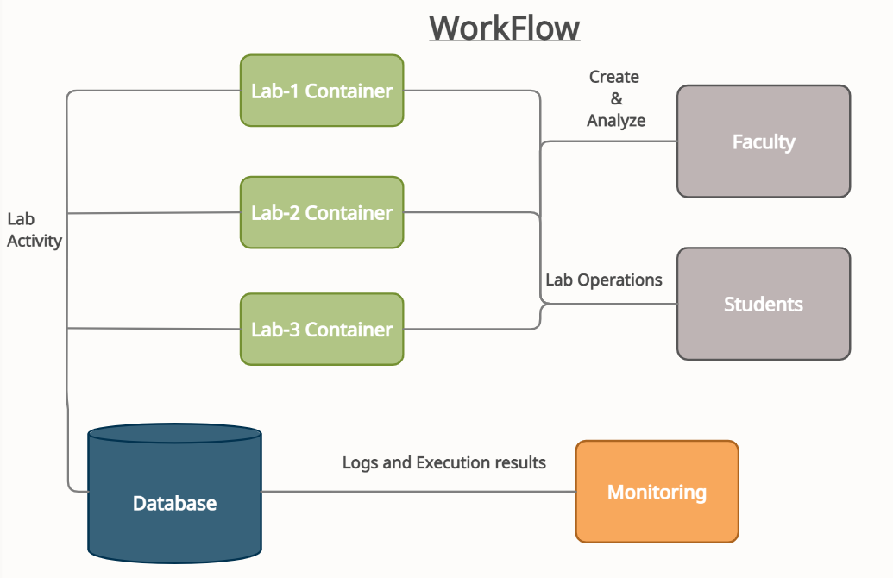
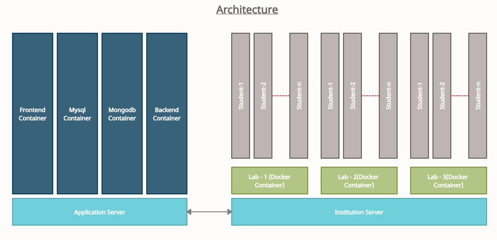
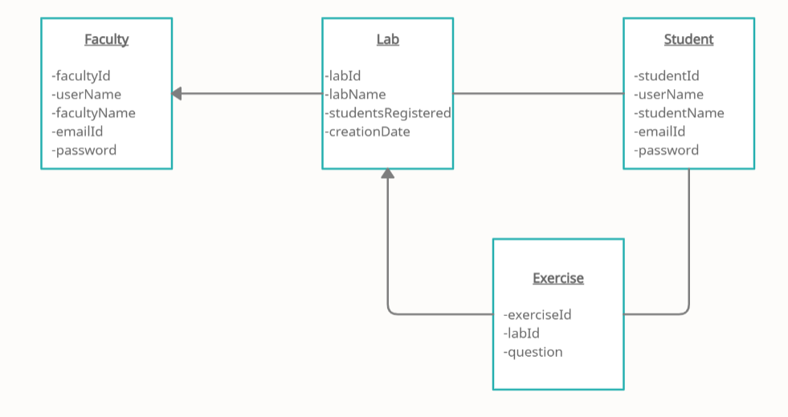

# **SPE Main Project - Virtual Lab**

Virtual lab is a simulated learning environment that allows students to complete computer
science laboratory exercises online and explore concepts and theories without stepping into
a physical lab. Virtual labs can be used to help faculty to explain complex theoretical
concepts. This project is aimed towards achieving the above concept. The key note behind
each lab is that each lab and student is isolated from other labs and other students. To
achieve this we have used the container based approach for creating labs.

Database Design
